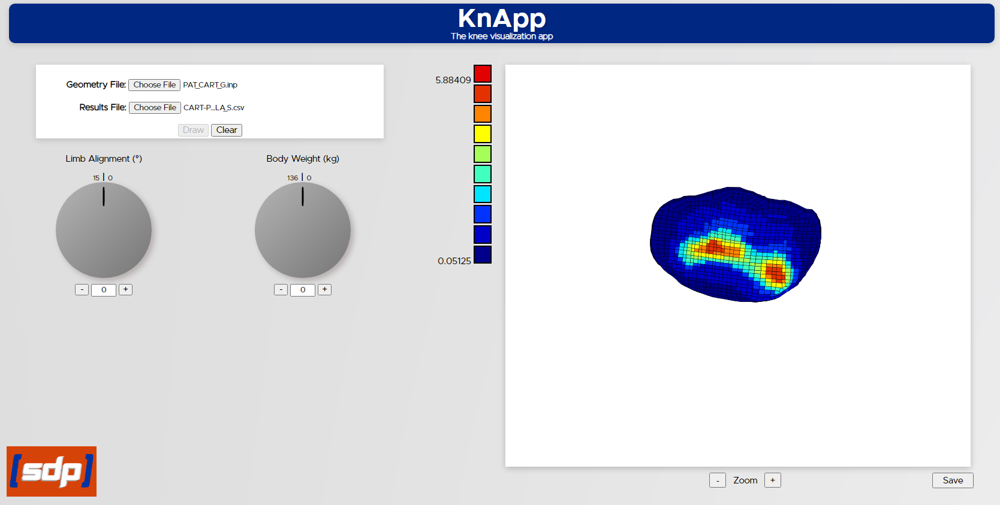

# KnApp  - The Knee Visualization App

## Created by Team Knee'd for Speed
Ezekiel Holmes  
Kate Rosenthal  
Mario Torres  
Mitchell Crocker   
Sharon Yang

## Project Abstract
Currently, Boise State University’s Computational Biosciences Lab (CBL)
simulates and models knee joint movement and stresses by producing numeric
datasets and results for osteoarthritis patients based on various parameters
such as loading conditions, anatomy, and movement. 

To make medical data more easily understandable for clinicians, we built this easy-to-use web
application where an user can upload data files, see a visual heat map of output,
and observe the shape and colorness of the image to easily understand the data
distribution.

## Project Description
The web application we've built primarily performs four key
functionalities as follows:
- File Uploading: Users upload geometry and results data file
in .inp or .csv format. The geometry file determines the shape
of the image and the results file determines the colors of data
points filled in the image.
- Data Parsing: The site parses these correctly and handles the
data in a way that the site can use to create an image.
- Image Generating: The site uses the parsed data to generate the
image of the knee.
- Parameters Updating: Parameters input could be updated arbitrary
by dialing on the panels.

To use this web application, firstly users click on the "Choose File"
button on the upper left of the web page following the title "Geometry File"
and select a Geometry data file in .inp format from their local drive,
then users click on the "Choose File" button following the title "Results File"
and select a Results data file in .csv format from their local drive.

Once these two files are chosen, click on the button "Draw", the users
will see an image on the right side of the web page showing the distribution
of the data. Users could also update the data parameters by dialing the two
circle panels or clicking on the "+" or "-" buttons on the sides of the panels.
Below is a snapshot of our web application.

