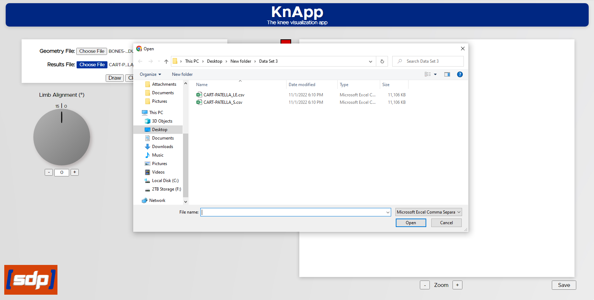

# KnApp

## Team Knee'd for Speed
Mitchell Crocker
Ezekiel Holmes  
Kate Rosenthal  
Mario Torres   
Sharon Yang

## Project Abstract
The Computational Biosciences Lab (CBL )at Boise State University simulates and models knee 
joint movement and stresses. They are currently producing numeric data sets and results for 
osteoarthritis patients based on parameters such as loading conditions, anatomy, and movement. 
These complex, numeric results are understandable for the department generating the data, but 
it is currently difficult to gather a high-level understanding of this output for clinicians 
and those unfamiliar with the field. 

To help solve this issue, our team has developed an easy-to-use web application with which 
a user can upload files containing the anatomic data provided by the CBL and see a 
visual heat map of contact pressure on different parts of the knee as output. Being able to 
see the Lab’s data in this way will hopefully make it more easily understandable and usable for 
clinicians.

## Project Description
### What We Built
The web application we've built performs four key
functionalities as follows:
- File Uploading: Users can upload geometry and results data files
in .inp and .csv format, respectively. The data in the geometry file 
determines the shape of the image produced by the app and the results file 
determines the values and colors of  in the image.
- Data Parsing: The site parses these correctly and handles the
data in a way that the site can use to create an image.
- Image Generating: The site uses the parsed data to generate the
image of the knee.
- Parameters Updating: Parameters input could be updated arbitrary
by dialing on the panels.

### How It Works
To use this web application, a user must first click on the "Choose File"
button on the upper left of the web page following the title "Geometry File"
and select a Geometry data file from their local drive. Files must be in .inp format
and the file name must include the tissue type they will produce- 'bone' for bone
files and 'cart' for cartlage files.

If the file is a bone file, the user can draw it accurately without a corresponding result
file, as the app is only designed to generate pressure maps for cartilage files. Bones are drawn 
entirely in grey.

If they are working with a cartilage file, users must then click on the "Choose File" button following 
the title "Results File" and select a Results data file from their local drive. If they do not select a
results file, the cartilage will be drawn in one single color rather than with a heat map applied.

Once their file(s) are chosen, users must click on the "Draw" button to generate their image. The image
will appear in the canvas element on the right side of the web page showing the distribution
of the data.

Currently, the parameter dials on the left side of the page do no affect the generated heat map.
They can be turned by clicking and dragging to rotate them, by clicking or holding the '+' and '-'
buttons below them, or by manually entering a value in their indicated range in the number input
area below them. Future work on the project could allow these values to update the heat map in
real time for the user to show them just how changes to these parameters could change where or
how much pressure is being applied to different parts of the knee.

## Visit the App
[KnApp](https://cs481-ekh.github.io/f22-kneed-for-speed/src/index.html)

Note: for the app to work properly, you must have a set of properly formatted files from the CBL
